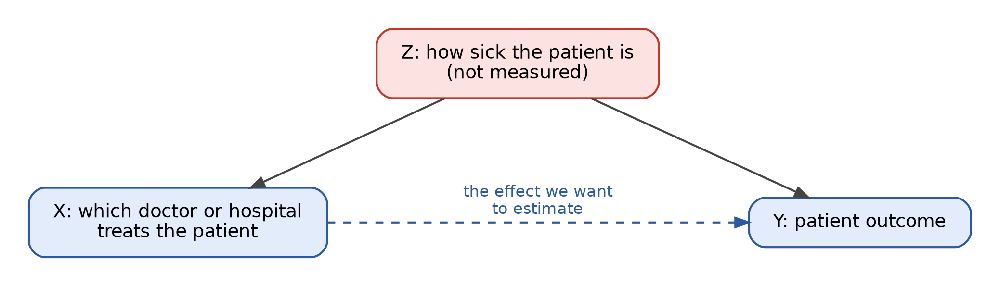

## Last Lecture Recap

Last lecture we talked a lot about **comparing groups**: t-tests, ANOVA, and their categorical and rank-based cousins, all following the same hypothesis-testing recipe. Today we take one more step. **Regression** is the tool that lets us compare groups *while accounting for other differences between them*, and it lets the "groups" be replaced by continuous predictors like age or dosage.

That's why regression is everywhere in observational research. In Lecture 2 we saw that observational studies can't randomize away confounders the way an RCT can. Regression is the main way researchers try to deal with confounding after the fact: measure the confounders and adjust for them. Today's papers are a case study in how well that works, and in what happens when an important variable is left out.

*IMPORTANT!* A regression coefficient tells you how the outcome differs when one variable differs, **among observations that look alike on everything else in the model.** Most misreadings of regression come from forgetting the words "in the model."

## From comparing groups to regression

Suppose you're comparing a treatment group and a control group on a continuous outcome. Define an indicator variable $X_i = 1$ if person $i$ is treated and $X_i = 0$ if not, and fit

$$Y_i = \beta_0 + \beta_1 X_i + \varepsilon_i$$

For a control subject, the model predicts $\beta_0$, so $\beta_0$ is the control group's mean. For a treated subject, it predicts $\beta_0 + \beta_1$, so $\beta_1$ is **the difference in group means**. Testing $H_0: \beta_1 = 0$ gives exactly the same result as last lecture's equal-variance (Student's) t-test, and using indicators for $k-1$ of $k$ groups reproduces one-way ANOVA. (Welch's and the rank-based tests are only approximately regressions, but the idea carries over.)

So the simplest regressions are tests we already know. What regression adds is the ability to swap in continuous predictors and to include many predictors at once.

## Simple linear regression

With one predictor $X$ and a continuous outcome $Y$, we model the outcome as a straight line plus noise:

$$Y_i = \beta_0 + \beta_1 X_i + \varepsilon_i$$

- $\beta_0$, the **intercept**: the expected value of $Y$ when $X = 0$.
- $\beta_1$, the **slope**: the expected change in $Y$ for a one-unit increase in $X$.
- $\varepsilon_i$, the **error**: everything about observation $i$ the line doesn't capture.

We estimate the $\beta$'s from data and write the estimates with hats. The standard method is **least squares**: choose the line that makes the sum of squared **residuals** (the vertical gaps between each observed $y_i$ and the line's prediction $\hat y_i$) as small as possible.

$$SS_{res} = \sum_{i=1}^{n} (y_i - \hat y_i)^2$$

### What does the slope mean?

"Is there any relationship between $X$ and $Y$?" becomes the test $H_0: \beta_1 = 0$, with the same signal-to-noise form as last lecture's t-test:

$$t = \frac{\hat\beta_1}{SE(\hat\beta_1)}$$

Everything from our hypothesis testing lecture applies unchanged: report the slope and its confidence interval, not just the p-value, and remember that "not significant" is not the same as "no effect."

The slope describes an **association**, not the result of an intervention. "Each additional hour of sleep is associated with a 3-point higher mood score" is a description; "sleeping one more hour will raise your mood score 3 points" is a causal claim, and as Lecture 2 showed, that requires a design that supports it.

### R-squared

In our hypothesis testing lecture, $R^2$ came up as an effect size. It measures the share of variation in $Y$ the model explains:

$$R^2 = 1 - \frac{SS_{res}}{SS_{tot}} \qquad \text{where } SS_{tot} = \sum_{i=1}^{n}(y_i - \bar y)^2$$

It runs from 0 (the line does no better than just predicting the average) to 1 (it explains everything). A low $R^2$ is not automatically bad: rare, noisy outcomes like newborn mortality depend on countless things no dataset captures, so a model can find a real relationship while explaining little of the total variation. And a high $R^2$ says nothing about causation.

## Multiple regression: "holding other things constant"

Real outcomes depend on many things at once:

$$Y_i = \beta_0 + \beta_1 X_{1i} + \beta_2 X_{2i} + \cdots + \beta_p X_{pi} + \varepsilon_i$$

Now $\beta_1$ is the expected change in $Y$ for a one-unit increase in $X_1$, **holding all the other predictors in the model fixed**. This is what papers mean by "controlled for" or "adjusted for." If $X_1$ is a treatment indicator and $X_2$ is age, $\beta_1$ is the difference between treatment and control *among people of the same age*, something no test from last lecture could give you.

### Fixed effects

Many observational studies include **fixed effects**: one indicator variable for each hospital, each physician, each year, and so on. A hospital fixed effect gives every hospital its own intercept, absorbing anything constant about that hospital (its patient population, equipment, overall quality). The remaining coefficients are then estimated from comparisons *within* hospitals. Fixed effects adjust for a lot without measuring it individually, but only for things that are constant within the group, not things that vary from patient to patient.

### Interactions: when one variable's effect depends on another

Sometimes the question isn't "does $X_1$ matter?" but "does the effect of $X_1$ depend on $X_2$?" That's an **interaction**, modeled by including the product of the two variables:

$$Y_i = \beta_0 + \beta_1 X_{1i} + \beta_2 X_{2i} + \beta_3 (X_{1i} \times X_{2i}) + \varepsilon_i$$

If $X_1$ and $X_2$ are both 0/1 indicators, there are four combinations, and $\beta_3$ measures how much the combination of both differs from what you'd expect by adding up their separate effects. Today's papers are built on exactly this structure: "racial concordance" asks whether outcomes differ when physician and patient race *match*, beyond the separate effects of each one's race. The concordance effect lives in the interaction coefficient.

## Confounding, revisited: omitted variable bias

In Lecture 2 we met confounding through ice cream and shark attacks. Multiple regression is how researchers try to fix confounding in observational data: include the confounder in the model and compare like with like. The catch is that regression can only adjust for what's **in the model**. So the real question about any observational regression is: what's missing, and how much does it matter?

Suppose the true relationship is

$$Y = \beta_0 + \beta_1 X + \beta_2 Z + \varepsilon$$

but $Z$ isn't measured, so we fit a model with $X$ alone. On average, the slope we get for $X$ will be

$$\tilde\beta_1 \approx \beta_1 + \beta_2 \delta$$

where $\delta$ is how strongly $Z$ tracks $X$ (the slope from regressing $Z$ on $X$). The extra term $\beta_2\delta$ is **omitted variable bias**.

Because the bias is a product, it gives a two-part test. A missing variable biases your result only if it:

1.  **affects the outcome** ($\beta_2 \neq 0$), and
2.  **is unevenly distributed across values of the predictor you care about** ($\delta \neq 0$).

If either is zero, leaving it out does no harm. If both are large, the bias can create an effect out of nothing, erase a real one, or flip its sign. This makes Lecture 2's advice ("think about what differs between the groups") concrete: name a candidate variable, then check both conditions.

### Good controls and bad controls

"Control for everything" isn't the answer either.

- A **good control** is determined *before* the predictor of interest and affects the outcome. That's a confounder; adjusting for it removes bias.
- A **bad control** is *caused by* the predictor of interest, a step along the causal pathway (a **mediator**). Adjusting for it removes part of the very effect you're trying to measure.

Asking "when was this variable determined, relative to the treatment?" is often the fastest way to tell them apart.

## Binary outcomes

Many outcomes are yes/no: did the patient survive, did the student graduate. As in Lecture 3, each is a **Bernoulli trial** with some probability $p$, and $p$ is what we want to model.

### The linear probability model

In Lecture 1, "code Yes as 1 and No as 0, then fit a model meant for continuous data" was our example of bad statistics. That warning is usually right, but the full story is more nuanced. Running ordinary regression on a 0/1 outcome has a name, the **linear probability model**, and it's common in economics because the slope reads directly as a change in probability: "a one-unit increase in $X$ is associated with a 0.2 percentage-point higher probability of death."

Its weaknesses are real: a straight line can predict probabilities below 0 or above 1, and the equal-variance assumption fails automatically, because a Bernoulli outcome's variance, $p(1-p)$, depends on $p$. It can be defensible, especially with many fixed effects and corrected standard errors, but it's a choice that should be justified.

### Logistic regression

The alternative models the **log-odds** of the outcome as a line instead:

$$\log\left(\frac{p}{1 - p}\right) = \beta_0 + \beta_1 X_1 + \cdots + \beta_k X_k$$

The **logit** function on the left stretches a probability (stuck between 0 and 1) across the whole number line, so the model can never predict an impossible probability. Exponentiating a coefficient gives an **odds ratio**, the effect size we met with 2×2 tables last lecture, except now it's **adjusted** for everything else in the model:

$$e^{\beta_1} = \text{odds ratio for } X_1$$

An odds ratio of 1 means no association, so a 95% CI including 1 corresponds to a non-significant result. And odds ratios aren't risk ratios: for common outcomes, they can look much more dramatic than the actual change in probability.

Logistic regression is fit by **maximum likelihood**: choose the coefficients that make the observed 0s and 1s most probable. In the language of our hypothesis testing lecture, the estimate is the peak of the log-likelihood, and its precision comes from the Fisher information, i.e., how sharp that peak is.

## Bias in regression

**Bias** is any systematic (not random) error in how a study is designed, conducted, or analyzed that pushes results away from the truth, intentional or not. More data doesn't fix it; it just gives a more precise wrong answer. Omitted variable bias is one kind. Two others matter especially for observational data like today's:

- **Selection bias**: the process that sorts observations into groups is related to the outcome. If sicker patients are routed to certain providers, a regression comparing providers partly measures patient sickness. This is the diagram above, and it's often *the* central problem in observational health research.
- **Information (measurement) bias**: variables are recorded with error, through faulty instruments, inconsistent coding, or human judgment. Administrative data like hospital billing and diagnosis codes reflect what someone chose to record and why, not a clean measurement of the truth. Random error in a predictor tends to shrink its coefficient toward zero; systematic error can push it in any direction.

Regression can't fix either one by itself. The strongest defenses are design-based: randomization where possible (Lecture 2), careful and standardized measurement, and **replication and reanalysis** by people who didn't produce the original result.

## Ethics and research misconduct

Our hypothesis testing lecture covered p-hacking and researcher degrees of freedom. Regression makes these especially easy to fall into, because every model involves choices: which controls to include, which observations to exclude, linear probability or logistic, which fixed effects. Trying many specifications and reporting the one that "works" is **specification searching**. The flip side: showing that a result holds (or doesn't) across reasonable alternative specifications is one of the most convincing things a paper can do. Two papers analyzing the same data with different models isn't misconduct; it's how science is supposed to check itself.

The line into formal **research misconduct** is crossed with **fabrication** (making up data or results), **falsification** (manipulating methods or data, or omitting data, so the record is inaccurate), or **plagiarism**. Studies using human subjects' data, even existing hospital records, also go through an **Institutional Review Board (IRB)**, which reviews research to ensure it meets ethical standards and protects participants.

## Potential Threats to Regression Coefficients

| Threat | What it does to a regression coefficient | Can adding controls fix it? |
|------------------------|------------------------|------------------------|
| Omitted confounder | Biased by $\beta_2\delta$; can create, hide, or flip an effect | Yes, if you can measure it |
| Selection into groups | Partly reflects who ends up in which group | Partly, if the drivers of selection are measured |
| Measurement error | Usually shrinks the coefficient toward zero | No; requires better measurement |
| Controlling for a mediator | Removes part of the real effect | No; it *is* the bad control |
| Specification searching | Reported p-value is too optimistic | No; requires transparency and robustness checks |

## Summary

- The simplest regressions are last lecture's tests; regression adds continuous predictors and adjustment for other variables.
- Each coefficient means "the difference in the outcome among observations alike on everything else **in the model**." Fixed effects and interactions extend what "the model" can capture.
- Binary outcomes can be modeled with a linear probability model (easy to interpret, but can predict impossible probabilities) or logistic regression (coefficients become adjusted odds ratios).
- Adjusting for measured confounders doesn't fix unmeasured ones. Omitted variable bias needs a variable that both affects the outcome and is unevenly distributed across the predictor.
- Selection bias, measurement bias, and specification searching all flow through a regression untouched. Design, transparency, and reanalysis are what catch them.

# Discussion

## [Greenwood BN, Hardeman RR, Huang L, Sojourner A. Physician–patient racial concordance and disparities in birthing mortality for newborns.](https://doi.org/10.1073/pnas.1913405117)

**Discussion Questions**

1.  How is the dataset cleaned/how is the data collected? Is there anything noteworthy about this?

2.  What is the response variable? What sort of model is used to analyze this? What are the trade-offs of that choice compared to logistic regression?

3.  Using the study types from Lecture 2, what kind of study is this? What does that design allow the authors to conclude, and what does it not?

4.  The authors include hospital and physician fixed effects and control for the 65 most common newborn comorbidities. What does each of these accomplish? Why might "most common" be a different criterion than "most important for predicting mortality"?

5.  How is a newborn assigned to a physician? List at least two ways that assignment might be related to how sick the newborn is, and explain why that matters for the regression.

## [Borjas GJ, VerBruggen R. Physician–patient racial concordance and newborn mortality.](https://doi.org/10.1073/pnas.2409264121)

**Discussion Questions**

1.  How does this paper address the first paper?

2.  Is everything adequately addressed?

3.  The added variable is determined before a physician is assigned. Why does that make it a reasonable control? Can you think of a variable in this setting that would be a *bad* control?

4.  The reanalysis finds the concordance effect becomes small and statistically insignificant. Is "not statistically significant" the same as "no effect"? What would you want to see before drawing a conclusion?

## [CNN: Black newborns more likely to survive when cared for by Black doctors (2020)](https://www.cnn.com/2020/08/18/health/black-babies-mortality-rate-doctors-study-wellness-scli-intl)

**Discussion Questions**

1.  Compare the article's framing to what the original paper actually estimated. Where, if anywhere, does it move from association to causation?

2.  If you could design a new study to answer the original question more convincingly, what would it look like? Is randomizing physician assignment feasible or ethical?
